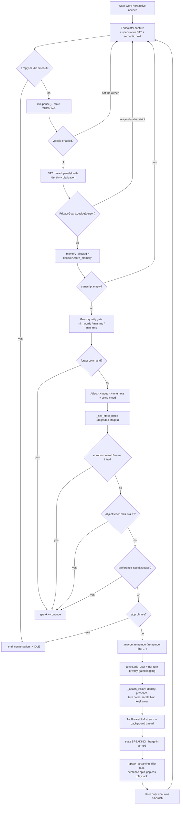

# ZERO — API & interface contracts

Every network surface in the repository, plus the internal Python interfaces
that play the role a framework's controller/service contracts would play
elsewhere.

There are **five HTTP servers** in this codebase. Two run on the Pi, three on the
GPU node. None of them uses an authentication mechanism of any kind.

| Server | Node | Port | Framework | Source |
|---|---|---|---|---|
| Control plane ("AF1 fusion surface") | Pi | 8090 | stdlib `ThreadingHTTPServer` | `zero/control.py` |
| Vision preview (MJPEG) | Pi | 8008 | stdlib `HTTPServer` | `zero/vision/preview.py` |
| Vision / perception service | GPU | 8000 | FastAPI + Uvicorn | `server/vision/app.py`, `server/vision/perception.py` |
| Whisper STT service | GPU | 9000 | FastAPI + Uvicorn | `server/whisper_server.py` |
| Orpheus TTS service | GPU | 9100 | FastAPI + Uvicorn | `server/orpheus_cpp_server.py` or `server/orpheus_server.py` |

Plus two consumed third-party HTTP APIs: **Ollama** (`/api/chat`,
`/api/embeddings`) and **SearXNG** (`/search?format=json`).

---

## 1. Control plane — Pi, port 8090

Runs as a daemon thread *inside* the `Zero` process, so every endpoint drives
the same `Conversation`, the same `SqliteMemory`, the same `ToolRegistry` and
the same speaker as the microphone loop. Enabled by `control.enabled`.

**Transport notes:** CORS is wide open (`Access-Control-Allow-Origin: *`,
methods `GET, POST, OPTIONS`, headers `Content-Type`). Request bodies are capped
at `_MAX_BODY = 32 MiB`. Malformed JSON is swallowed and treated as `{}`. Every
handler is wrapped so a request can never kill the robot.

### `GET /health` · `GET /zero/health`

```json
{ "ok": true, "service": "zero-control", "ready": true, "state": "idle" }
```

`ready` flips true only after LLM warmup completes; `state` is the lowercased
`State` enum value (`idle` | `listening` | `thinking` | `speaking`). The server
is started *before* warmup so `/health` answers immediately.

### `GET /zero/status`

Returns `Zero.external_status()`:

```json
{
  "ok": true,
  "state": "idle",
  "ready": true,
  "last": { "heard": "...", "reply": "...", "t": 1730000000.0 },
  "voice_degraded": false,
  "stt_degraded": false
}
```

`voice_degraded` / `stt_degraded` are `null` in text mode.

### `POST /zero/say`

Speak one line on the Pi speaker. No brain turn, no history, no memory write.

| Field | Type | Notes |
|---|---|---|
| `text` | string | **required**, truncated to 500 chars |
| `voice` | string? | Orpheus speaker name; overrides the default *for this request only* |

Responses: `200 {"ok": true}` · `400 {"ok": false, "error": "empty-text"}`.

### `POST /zero/turn`

A full turn from recorded audio. The **request body is raw audio bytes** — any
container ffmpeg can decode (webm, ogg, wav, mp4). Not multipart, not JSON.

Query parameters: `?voice=<orpheus_voice>&person_id=<int>`.

Pipeline: `ffmpeg` → mono float32 at `audio.sample_rate` → `stt.transcribe` →
`external_turn_text`.

| Status | Body |
|---|---|
| 200 | `{"ok": true, "heard": "...", "reply": "..."}` |
| 400 | `{"ok": false, "error": "empty-audio"}` |
| 422 | `{"ok": false, "error": "decode: ffmpeg decode failed: <stderr tail>"}` |
| 500 | `{"ok": false, "error": "stt: …" \| "empty-transcript" \| "empty-reply" \| "busy-speaking"}` |

### `POST /zero/turn_text`

| Field | Type | Default | Notes |
|---|---|---|---|
| `text` | string | — | **required**, truncated to 1200 chars |
| `voice` | string? | config default | per-request Orpheus voice |
| `speak` | bool | `true` | `false` returns the reply without using the speaker |
| `person_id` | int? | `control.person_id` (1) | memory owner for the episode written |

Same response shape as `/zero/turn`.

### `POST /zero/control`

| Field | Value | Effect |
|---|---|---|
| `action` | `"sleep"` | `external_sleep()` — resets the conversation **only if state is IDLE**, so it can never truncate a live mic conversation |

Unknown actions return `400 {"ok": false, "error": "unknown-action:<x>"}`.

### Concurrency semantics for external turns

All three turn/say endpoints take `Zero._ext_lock`, then call
`_wait_not_busy(20 s)` which polls until the state leaves `THINKING`/`SPEAKING`.
This is how an AF1 turn and a native mic turn are prevented from talking over
each other on one speaker. Timing out returns `busy-speaking`.

An external turn writes an episode to memory tagged `(via AF1) they said: … — I
replied: …` under `person_id`, but does **not** write to `_session_log`,
`_corpus_log`, or trigger fact extraction.

> **Security:** default bind is `0.0.0.0:8090` with no auth, no rate limit and
> permissive CORS. Anyone on the LAN can make the robot speak arbitrary text,
> run tools (including `web_search`) and write to its memory. The code comments
> call this "LAN-only by design". Treat the LAN as the trust boundary, or bind
> to `127.0.0.1` and reach it over SSH.

---

## 2. Vision preview — Pi, port 8008

Enabled by `vision.preview` with `vision.preview_mode` in `auto` | `window` |
`web`. In web mode a stdlib HTTP server serves an MJPEG stream at `/`.
Bind address is `vision.preview_host`, default `127.0.0.1` (private).

Setting it to `0.0.0.0` publishes an **unauthenticated live camera feed** to the
whole LAN. The factory comment makes the default deliberate.

---

## 3. GPU vision service — port 8000 (FastAPI)

`app = FastAPI(title="Zero Vision GPU service", version="0.6-perceive")`.
Models are lazy-loaded and cached for the process lifetime, so `/health` never
pays for torch.

### `GET /health`

```json
{ "status": "ok", "gpu": true, "vram_gb": 15.99 }
```

Degrades to `gpu: false, vram_gb: 0.0` when torch or CUDA is absent.

### `POST /facts` → `AnalyzeResponse`

Frame + detections → per-object grounded distance and bearing.
`reply` comes back empty.

**Request (`AnalyzeRequest`)**

| Field | Type | Required | Notes |
|---|---|---|---|
| `image_jpeg_b64` | string | yes | base64 JPEG |
| `detections` | `Detection[]` | no (default `[]`) | |
| `question` | string | **yes on the server copy**, optional on the Pi copy | see the drift note in `architecture.md` §8 |
| `history` | `dict[]` | no | `[{role, content}, …]` |

**`Detection`**: `label: str`, `bbox: [x, y, w, h]` (exactly 4 floats, pixels),
`confidence: float ∈ [0,1]`, `color: str?`.

**Response (`AnalyzeResponse`)**: `facts: SceneFact[]`, `reply: str`.
**`SceneFact`**: `label`, `color?`, `distance_m: float ≥ 0 ?`,
`bearing: "left"|"center"|"right" ?` (optionally with `high`/`low`).

Pipeline: decode → Depth Anything V2 → intrinsics (calibrated file, or a 70° FOV
fallback) → central-crop median depth per box → back-project → `atan2(X, Z)`
bearing. Errors: `422` on empty/undecodable base64.

### `POST /analyze` → `AnalyzeResponse`

Runs `/facts`, then a local VLM (Qwen2-VL-2B-Instruct by default, or
Moondream2) grounded in those facts, returning both. This is the long-tail
naming path used when the main LLM is **not** multimodal.

### `POST /perceive/detect`

Body `{"image_jpeg_b64": str, "max_faces": int = 3}` (`max_faces` unused here).
Returns `{"detections": [{"label", "bbox": [x,y,w,h], "confidence"}]}` from
YOLO11x at `conf = 0.35`. `503` when `ultralytics` is missing.

### `POST /perceive/face`

Same body. Returns `{"faces": [{"embedding": float[], "bbox": [x,y,w,h]}]}`,
largest-first, capped at `max_faces`. Uses InsightFace SCRFD+ArcFace when
available, otherwise Haar cascade + an ArcFace ONNX at 112×112 with
`(x - 127.5)/128` normalisation. Embeddings are L2-normalised.

### `POST /perceive/speaker`

Body is a **raw 16-bit mono WAV at exactly 16 kHz** (not JSON). Returns
`{"embedding": float[] | null}` from the repo's own `SpeakerVerifier`.
`422` on a non-WAV body or a non-16 kHz rate; `503` when the ECAPA ONNX is
missing.

### `POST /perceive/embed_object`

Body `{"image_jpeg_b64": <crop>}`. Returns
`{"embedding": float[], "dim": int}` from CLIP ViT-B/32, L2-normalised, or
`{"embedding": null, "dim": 0}` for a degenerate crop. `503` without
transformers + torch.

> Every `/perceive/*` model is guarded by a shared `_LOAD_LOCK` with
> double-checked locking. Without it, FastAPI's sync threadpool would start one
> weight download per concurrent request and corrupt the cache.

---

## 4. Whisper STT service — port 9000

| Endpoint | Body | Response |
|---|---|---|
| `GET /health` | — | `{"ok": <model loaded>}` |
| `POST /transcribe` | raw WAV bytes | `{"text": str, "seconds": float}` |

Query parameter `?language=` overrides the server default per request;
`language=auto` lets Whisper detect (used for English/Swahili code-switching).

Decoding uses `beam_size=1`, `temperature=0.0`,
`condition_on_previous_text=False` (kills repetition loops) and a Silero
`vad_filter` with `min_silence_duration_ms=300`, `no_speech_threshold=0.6`
(kills phantom "Thank you" on silence). If the VAD path raises, the server
**retries once without it** rather than 500-ing and leaving the Pi deaf.

CLI: `--model` (default `deepdml/faster-whisper-large-v3-turbo-ct2`), `--port`
9000, `--host` 127.0.0.1, `--device` cuda, `--compute-type` float16,
`--language` en.

---

## 5. Orpheus TTS service — port 9100

Both implementations expose an identical contract, so `RemoteTTS` is unchanged
between them.

| Endpoint | Body | Response |
|---|---|---|
| `GET /health` | — | `{"ok": <model loaded>}` |
| `POST /tts` | `{"text": str, "voice": str = "tara"}` | `audio/wav`, 24 kHz mono 16-bit |
| `POST /tts_stream` | same | `application/octet-stream`, raw int16 PCM 24 kHz, streamed |

Voices: `tara leah jess mia zoe` (female), `leo dan zac` (male).

The Pi consumes `/tts_stream` in 2048-byte chunks (≈43 ms at 24 kHz) so first
sound lands ~200 ms in. It derives the stream URL by string-replacing `/tts` →
`/tts_stream` in `tts.orpheus.url` — a coupling worth remembering if the URL
shape changes.

---

## 6. Consumed third-party APIs

### Ollama

```
POST {llm.host}/api/chat
{
  "model": "gemma4:latest",
  "messages": [ {"role","content", "images"?: [b64jpeg,...]} ],
  "stream": true,
  "keep_alive": -1,
  "think": false,
  "options": { "temperature": 0.6, "num_predict": 500, "num_ctx": 4096 }
}
```

Read as NDJSON; each line's `message.content` is yielded. `keep_alive: -1` pins
the model in VRAM. `think: false` suppresses hidden reasoning that would empty
`content`. **`warmup()` must send the same `options`** — a differing `num_ctx`
makes Ollama rebuild the runner and costs a multi-second first-token stall.
`resp.close()` in a `finally` block stops server-side generation on barge-in.

`POST /api/embeddings` is used by `OllamaEmbedder` with a dedicated embedding
model (`nomic-embed-text`) — a chat model cannot serve this endpoint, which
previously degraded recall to hash matching silently.

### SearXNG

`GET {tools.websearch.url}?q=<query>&format=json`. The parser is deliberately
defensive: it accepts a dict with `results` and/or `answers`, or a bare list;
`answers` may be strings or dicts; non-dict entries in `results` are skipped
rather than raising. Lines are truncated to 280 chars and capped at
`max_results`.

---

## 7. The "middleware pipeline"

There is no HTTP middleware stack (no auth guard, no rate limiter, no
compression, no request logging beyond a `log.debug`). The equivalent
cross-cutting chain runs **per conversational turn**, and this is the ordering
that matters:



Note that every early-exit branch (`forget`, enrolment, object teaching,
preference) speaks a fixed line and pushes both turns into `Conversation`, so the
LLM's view of the dialogue stays consistent even though it was never consulted.

Privacy is enforced **per turn at log time**, not at session end — a bystander's
words never enter `_session_log` or `_corpus_log` at all, so one stranger
speaking at the end of a session cannot void a known person's whole history.

---

## 8. Internal interface contracts

These ABCs are the seams the factory writes against. Adding an engine means
implementing one of these and adding a branch in `zero/factory.py`.

| Interface | File | Required methods | Optional / duck-typed |
|---|---|---|---|
| `WakeWord` | `zero/wake/base.py` | `process(frame) -> bool`, `reset()` | |
| `_BaseEndpointer` | `zero/vad/endpointer.py` | `_is_speech(frame) -> bool` | `_on_capture_start()`; public `capture(frames, idle_timeout_s, on_speech_pause, should_hold)`, `is_speech_frame(frame)` |
| `STT` | `zero/stt/base.py` | `transcribe(audio, sample_rate) -> str` | `close()`, `degraded` |
| `LLM` | `zero/llm/base.py` | `stream(messages) -> Iterator[str]` | `complete()`, `close()`, `warmup(messages)` |
| `TTS` | `zero/tts/base.py` | `synthesize(text) -> np.ndarray`; class attr `sample_rate` | `synthesize_stream(text)` (defaults to one chunk), `close()`, `length_scale`, `voice`, `degraded` |
| `Tool` | `zero/tools/base.py` | `run(args, ctx) -> str`; class attrs `name`, `description`, `parameters` | `confirm_required`; `safe_run` is provided |
| Embedder | `zero/memory/embeddings.py` | `embed(text) -> np.ndarray \| None`; property `name` | |
| Object embedder | `zero/vision/learned.py` | `embed(crop_rgb) -> np.ndarray \| None`; `name` | |
| Face recogniser | `zero/identity/face.py` | `embed_faces(frame_rgb, max_faces) -> [(vec, box)]`, `detect(frame_rgb)` | |
| Speaker embedder | `zero/voiceid/speaker.py` | `embed(audio) -> np.ndarray \| None`, `verify(enrolled, audio) -> (score, bool)` | |
| Preview sink | `zero/vision/preview.py` | `show(frame_rgb, detections)`, `close()`, property `ok` | |

### `ToolContext`

Deliberately narrow — a tool receives the memory store, the event bus, and who
is speaking. Not the app, not the config, not the LLM.

```python
@dataclass
class ToolContext:
    memory: object | None      # SqliteMemory
    events: object | None      # EventBus
    person_id: int | None
    person_name: str | None
    extras: dict
```

It is rebuilt per call via `Zero._tool_context`, so a mid-session speaker
handover is reflected immediately.

### Registered tools

| Name | Args | Behaviour |
|---|---|---|
| `time` | — | current time + date |
| `timer` | `duration`, `label?` | spawns a daemon thread that posts a `timer` Event |
| `reminder` | `duration`, `about` | same, **plus** a memory write so a reboot doesn't eat the promise |
| `remember` | `fact` | `memory.remember(f"note ({person})", fact)` |
| `recall` | `query` | activation-ranked `memory.search`, top 4 |
| `web_search` | `query` | SearXNG; registered only when `tools.websearch.enabled` |

`tools.allow` is the boundary: `ToolRegistry.register` refuses anything not
named there and logs `tool %r not on the allow-list — skipped`. The default
allow-list is `[time, timer, reminder, remember, recall, web_search]` — i.e.
everything implemented.

The tool spec block injected into the system prompt instructs the model to reply
with exactly `{"tool": "<name>", "args": {...}}` on a single line. The router
tolerates code fences, a leading `json` word, trailing prose after the JSON, a
call embedded mid-sentence, and `args` arriving as a bare string (coerced to
`{"query": ...}`).
