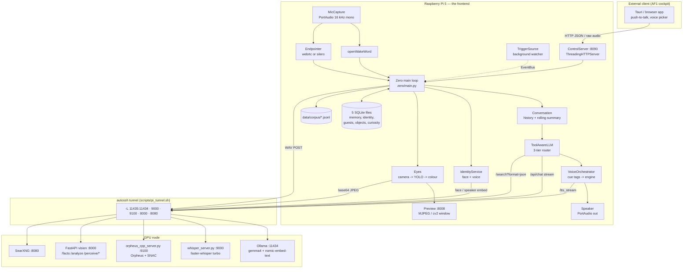
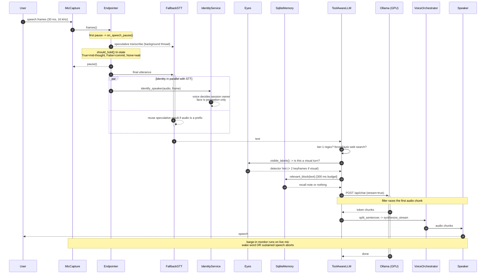
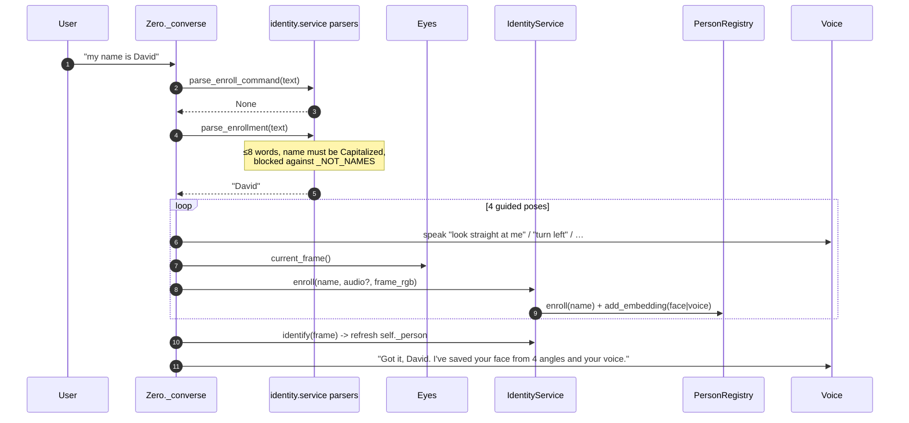
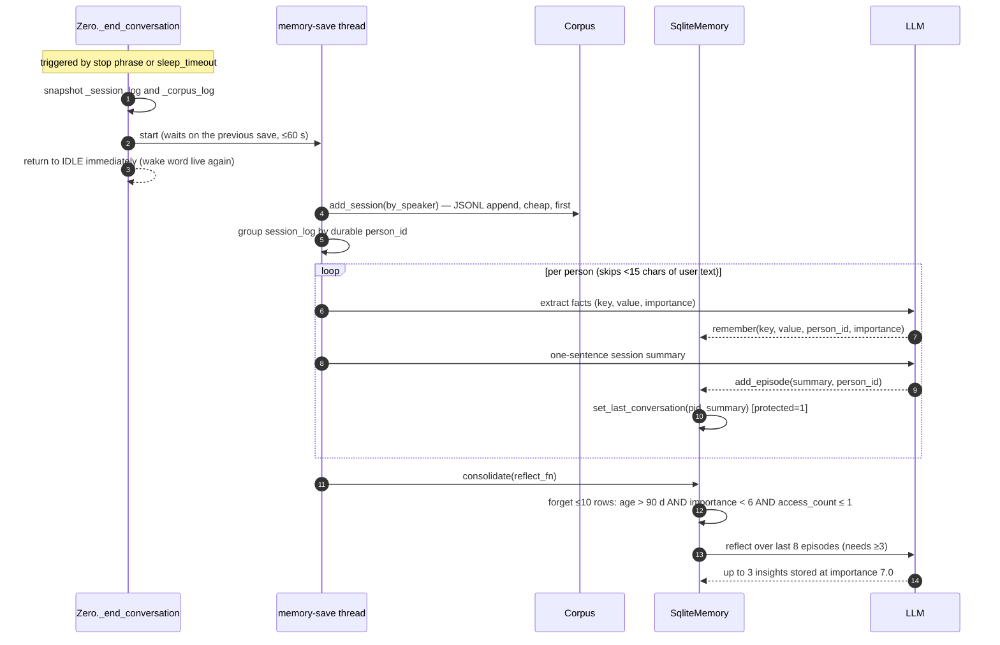
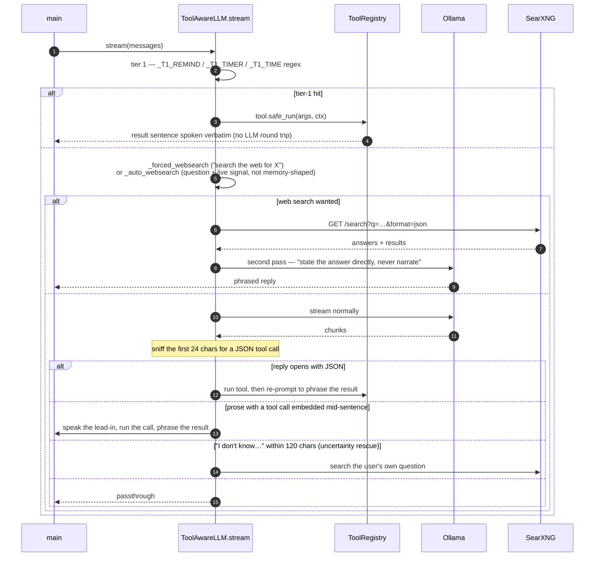

# ZERO — Architecture

> Reverse-engineered from the source at `Obila34/ZERO`, branch
> `claude/agent-human-feel-diagnostic-5al4hb`. This describes the code **as it
> is**, not as the roadmap docs (`docs/PLAN.md`, `docs/VISION.md`) describe the
> intended future. Where the two disagree, the code wins and the gap is flagged.

**Companion documents**

| Document | Covers |
|---|---|
| [`architecture.md`](architecture.md) | This file — stack, structure, patterns, execution flows, observability |
| [`api.md`](api.md) | Every HTTP endpoint and every internal interface contract |
| [`database.md`](database.md) | The five SQLite stores, the ERD, the JSONL corpus |
| [`configuration.md`](configuration.md) | Master table of every config key and environment variable |
| [`deployment.md`](deployment.md) | systemd units, the SSH tunnel, CI, setup scripts |

---

## 1. Executive summary & tech stack

### What the project does

ZERO is a **conversational voice robot** that runs on a Raspberry Pi 5 and
optionally offloads its heavy models to a GPU node over a single SSH tunnel. It
implements a continuous speech loop:

```
IDLE ──(wake word)──> LISTENING ──(endpoint)──> THINKING ──> SPEAKING ──> IDLE
```

Beyond the basic loop, the codebase implements a set of "human-feel" faculties,
each of which is a real module with real state:

- **Eyes** — an always-on camera → YOLO → colour loop (`zero/vision/eyes.py`),
  so the scene is already perceived before a question is asked. Keyframes are
  handed to a multimodal LLM on visual turns.
- **Identity** — face + voice embeddings fused into a person registry;
  conversational enrolment ("I'm David"), voice-owned sessions, and provisional
  "guest" clustering for unfamiliar voices.
- **Memory** — a layered SQLite store (semantic / episodic / procedural) with
  activation-ranked retrieval, reconsolidation on access, sleep-phase
  consolidation, gentle forgetting and a protected per-person
  "last conversation" record.
- **Tools** — a three-tier action router (regex intents → LLM JSON tool calls →
  plain chat) with an allow-list boundary, plus live web search.
- **Proactivity** — a background watcher that can greet, ask a queued curiosity
  question or make an ambient remark, behind cooldowns, quiet hours and an
  hourly cap.
- **Privacy** — a bystander guard (`open` / `guarded` / `strict`), spoken
  erasure commands, and a GPIO "I'm listening" indicator.
- **Learning** — few-shot object teaching ("this is a french press") and an
  interaction corpus written as per-speaker JSONL for offline fine-tuning.
- **AF1 control plane** — an HTTP server running *inside* the ZERO process so an
  external cockpit app can drive the same brain, memory and speaker.

Every pipeline stage sits behind a small ABC and is selected by name in
`config.yaml`, so engines are swapped without touching call sites.

### Languages, frameworks and runtimes

| Area | Choice | Where |
|---|---|---|
| Language | Python ≥ 3.10 (CI runs 3.11) | `pyproject.toml`, `.github/workflows/ci.yml` |
| Packaging | setuptools ≥ 68, `build_meta` | `pyproject.toml` |
| Console script | `zero = zero.main:main` | `pyproject.toml` |
| Lint | ruff ≥ 0.4, line-length 100, rules `E9` + `F`, ignore `E731` | `pyproject.toml` |
| Test | pytest ≥ 7.0, `testpaths = ["tests"]` | `pyproject.toml` |
| GPU service framework | FastAPI + Uvicorn | `server/vision/requirements.txt` |
| Pi-side HTTP servers | stdlib `http.server.ThreadingHTTPServer` (no framework) | `zero/control.py`, `zero/vision/preview.py` |
| Config | YAML, deep-merged local override | `zero/config.py` |
| Concurrency | `threading` + `queue` only — no asyncio in the Pi app | throughout |

### Third-party libraries, with the versions the repo declares

**Pi core** (`requirements.txt` / `[project.dependencies]`)

| Package | Constraint | Role |
|---|---|---|
| `sounddevice` | `>=0.4.6` | PortAudio mic capture + speaker playback |
| `numpy` | `>=1.24` | every audio/vision buffer |
| `soundfile` | `>=0.12` | reads the non-verbal WAV clips |
| `PyYAML` | `>=6.0` | `config.yaml` |
| `openwakeword` | `>=0.6.0` | always-on wake word |
| `webrtcvad` | `>=2.0.10` | energy/VAD endpointing fallback |
| `pywhispercpp` | `>=1.2.0` | local whisper.cpp STT fallback |
| `requests` | `>=2.31` | all HTTP clients (Ollama, Whisper, Orpheus, Vision, SearXNG) |

**Pi vision extra** (`requirements-vision.txt` / `[project.optional-dependencies.vision]`)

| Package | Constraint | Role |
|---|---|---|
| `opencv-python` | `>=4.8` | camera, HSV colour naming, JPEG encode, preview drawing |
| `onnxruntime` | `>=1.16` | YOLO11n/11s inference, Silero VAD, ArcFace, ECAPA |
| `pydantic` | `>=2.0` | the vision wire schema |

**GPU node** (`server/vision/requirements.txt`)

`fastapi>=0.110`, `uvicorn[standard]>=0.29`, `pydantic>=2.6`, `pyyaml>=6.0`,
`torch>=2.2`, `transformers>=4.49`, `pillow>=10.0`,
`opencv-python-headless>=4.8`, `numpy>=1.24`, `accelerate>=0.30`.
Commented-out optionals: `bitsandbytes>=0.43` (4/8-bit VLM), `einops>=0.7`
(Moondream backend). Not listed but imported by GPU code:
`ultralytics` (YOLO11x, `server/vision/perception.py`), `insightface`
(preferred face engine), `faster-whisper` (`server/whisper_server.py`),
`orpheus-cpp` / `orpheus-speech`+`vllm` (the two TTS servers).

**Optional / soft dependencies** imported behind `try` blocks: `gpiozero`
(LED indicator), `speexdsp` (AEC), `torch` (Silero VAD via `torch.hub`, if the
ONNX file is absent).

**Undeclared but installed by `scripts/setup_pi.sh`:** `cffi`, `scipy`,
`scikit-learn`, `tqdm`, `setuptools<81`. These are not in `requirements.txt` —
a drift worth noting.

### Models (not source; fetched or checked in)

| Model | Runs on | Selected by |
|---|---|---|
| openWakeWord `hey_jarvis` | Pi | `wake.model` |
| Silero VAD ONNX / webrtcvad | Pi | `vad.engine` |
| whisper.cpp `ggml-base.en.bin` | Pi (fallback) | `stt.model_path` |
| faster-whisper `large-v3-turbo` (CT2) | GPU | `--model` flag |
| Ollama `gemma4:latest` | GPU | `llm.model` |
| `nomic-embed-text` (embeddings) | GPU | `memory.embeddings.ollama_model` |
| Orpheus 3B (GGUF or fp16 vLLM) | GPU | `tts.orpheus.url` |
| Piper `en_US-amy-medium` | Pi (fallback) | `tts.piper.voice` |
| YOLO11n / YOLO11s / YOLOv8s-worldv2 ONNX | Pi | `vision.detect.model_path` — **checked into the repo** |
| YOLO11x `.pt` | GPU | `YOLO_MODEL` constant in `server/vision/perception.py` |
| Depth Anything V2 Metric-Indoor-Small | GPU | `depth.model` |
| Qwen2-VL-2B-Instruct / Moondream2 | GPU | `vlm.model`, `vlm.backend` |
| WeSpeaker ECAPA-TDNN ONNX (192-d) | Pi + GPU | `identity.voice.model_path` |
| ArcFace / InsightFace buffalo_l | Pi + GPU | `identity.face.model_path` |
| CLIP ViT-B/32 | GPU | `CLIP_MODEL` constant |

---

## 2. High-level architecture

Two physical nodes joined by **one** autossh tunnel carrying five forwards.
Nothing is exposed to the internet.



**Load balancer:** none. **Message queue / broker:** none — the in-process
`EventBus` (`zero/events.py`, a wrapped `queue.Queue`, maxsize 64) is the only
queue, and it never leaves the process.

### The degradation ladder

This is the single most pervasive design decision in the codebase. Every remote
stage has a *lazily built* local fallback, tried per call, with the remote
retried every turn so quality returns the moment the tunnel does:

| Stage | Primary (GPU) | Fallback (Pi) | Wrapper |
|---|---|---|---|
| STT | `RemoteSTT` → :9000 | `WhisperCppSTT` | `FallbackSTT` |
| TTS | `RemoteTTS` → :9100 | `PiperTTS` | `FallbackTTS` |
| Detection | `RemoteDetector` → `/perceive/detect` | ONNX `Detector` | `FallbackDetector` |
| Face | `RemoteFaceRecognizer` | `FaceRecognizer` | `FallbackFace` |
| Speaker embed | `RemoteSpeakerEmbedder` | `SpeakerVerifier` | `FallbackSpeaker` |
| Object embed | `RemoteObjectEmbedder` (CLIP) | `HistEmbedder` | `FallbackObjectEmbedder` |
| Text embed | `OllamaEmbedder` | `HashEmbedder` | `ResilientEmbedder` |

Each wrapper exposes a `degraded` flag. `Zero._self_state_notes()` reads the TTS
and STT flags once per transition and injects a note into the prompt so ZERO can
say *"my main voice is down"* rather than silently sounding wrong.

---

## 3. Folder / module structure

The layout is **layered-by-capability with an interface seam per stage** — not
MVC, not hexagonal in the formal sense, but the same intent: `zero/factory.py`
is the composition root, every `*/base.py` is a port, every `*_engine.py` is an
adapter.

| Path | Responsibility | Why it exists |
|---|---|---|
| `zero/main.py` | The `Zero` class: state machine, turn loop, barge-in, streaming TTS, session persistence, external-turn API. **1,866 lines — by far the largest file.** | The orchestrator; everything else is a faculty it calls |
| `zero/factory.py` | `build_*` functions mapping config strings → concrete classes | The only place that knows engine names; keeps `main.py` engine-agnostic |
| `zero/config.py` | `Config` dotted-access wrapper; `config.yaml` deep-merged with `config.local.yaml` | Per-device overrides without touching source |
| `zero/state.py` | `State` enum + legal `TRANSITIONS` table | Makes wiring bugs loud (`can_transition`) |
| `zero/events.py` | `Event` dataclass + thread-safe `EventBus` | How background faculties get a word in without racing the reply |
| `zero/conversation.py` | Prompt assembly, cache-friendly trimming, rolling compaction | Ollama prefix-cache economics |
| `zero/control.py` | HTTP control plane (the "AF1 fusion surface") on :8090 | External clients drive the *same* brain, not a copy |
| `zero/llm/` | `base.LLM` ABC, `ollama_engine`, `persona` (the system prompt) | Persona is source, not config — see the note in `config.yaml` |
| `zero/stt/` | `base.STT`, `remote_engine`, `whispercpp_engine`, `fallback` | |
| `zero/tts/` | `base.TTS`, `orchestrator`, `remote_engine` (Orpheus), `piper_engine`, `fish_engine`, `fallback`, `nonverbals/` | Cue-tag vocabulary shared with the persona prompt |
| `zero/wake/` | `base.WakeWord`, `openwakeword_engine` | |
| `zero/vad/` | `endpointer` — `_BaseEndpointer` + Silero/webrtc subclasses, semantic hold | Endpoint intelligence lives here, not in `main` |
| `zero/audio/` | `capture`, `playback`, `bargein`, `aec` | Device-level concerns, resample-on-the-fly |
| `zero/vision/` | `eyes` (always-on loop), `camera`, `detector`, `scene`, `tracker`, `color_namer`, `coco`, `phrasing`, `learned`, `gpu_client`, `preview`, `schemas` | The Pi half of vision |
| `zero/identity/` | `service`, `registry`, `fuser`, `face`, `guests` | "Who is this?" as its own bounded context |
| `zero/memory/` | `sqlite_memory`, `embeddings`, `preferences` | Long-term store + retrieval + procedural prefs |
| `zero/perception/` | `affect`, `diarize`, `remote` | Reading *how* things are said, plus the GPU perception clients |
| `zero/proactive/` | `triggers`, `policy`, `curiosity` | Initiative + the gates that keep it quiet |
| `zero/privacy/` | `guard`, `indicator` | Bystander policy and the visible signal |
| `zero/learning/` | `corpus` | Training-data capture |
| `zero/voiceid/` | `speaker` — ECAPA fbank front-end in pure NumPy | Owner verification; also reused server-side |
| `zero/tools/` | `base`, `registry`, `router`, `builtin`, `timers`, `websearch` | The hands |
| `zero/utils/logging.py` | One `basicConfig` | |
| `server/whisper_server.py` | GPU STT service | |
| `server/orpheus_server.py` / `orpheus_cpp_server.py` | GPU TTS services (fp16 vLLM vs quantized GGUF) — identical endpoints | |
| `server/vision/` | FastAPI app: `app.py`, `perception.py` (`/perceive/*` router), `depth/`, `facts/`, `vlm/`, `shared/schemas.py`, its own `config.yaml` | The GPU half of vision |
| `scripts/` | `setup_pi.sh`, `pi_tunnel.sh`, `run_gpu_servers.sh`, `deploy_control_pi.sh`, `healthcheck.sh`, `export_corpus.py`, `export_yolo_onnx.py`, camera/audio utilities, `systemd/` | |
| `tests/` | 26 pytest modules, **374 tests, all passing** on `numpy PyYAML requests pydantic pytest` alone | Pure-logic tests only; the audio/vision stacks are exercised on-device |
| `docs/` | Pre-existing narrative docs (`OPERATIONS`, `PLAN`, `VISION`, `PROGRESS`, `TRAINING`, `FINETUNE`, `REMOTE`, `GPU_OFFLOAD_PLAN`, `ZERO_NOW`) | Roadmap and runbook, not generated |

Top-level oddities: `test_microphone.py` and `test_voiceid.py` live at the repo
root (they are interactive device utilities, not pytest modules — the pytest
copies are under `tests/`), and `ZERO - Operations & Architecture Guide.pdf`
plus four `.onnx` weight files are committed.

---

## 4. Design patterns in use

| Pattern | Where | Notes |
|---|---|---|
| **Abstract factory / composition root** | `zero/factory.py` | Every `build_*(cfg)` returns an interface. `Zero.__init__` calls nothing but factories. |
| **Strategy** | `wake.base.WakeWord`, `stt.base.STT`, `tts.base.TTS`, `llm.base.LLM`, `_BaseEndpointer` | Engine chosen by a config string; `ValueError(f"unknown … engine")` on a bad name |
| **Decorator / proxy** | `FallbackSTT`, `FallbackTTS`, `Fallback*` in `perception/remote.py`, `ResilientEmbedder`, `ToolAwareLLM` | Each implements the wrapped interface exactly, so callers never learn about failover or tools |
| **Adapter** | `RemoteSTT`, `RemoteTTS`, `RemoteDetector`, `VisionClient`, `PerceptionClient` | HTTP behind a local-looking method |
| **Registry + allow-list** | `ToolRegistry` | `register()` silently skips anything not in `tools.allow` — the security boundary |
| **Chain of responsibility** | `ToolAwareLLM.stream` | tier-1 regex → forced/auto web search → JSON tool call → passthrough prose |
| **Observer / pub-sub** | `EventBus` + `TriggerSource` + `TimerManager` | Background threads post; the main loop drains at safe points only |
| **Repository** | `SqliteMemory`, `PersonRegistry`, `GuestBook`, `LearnedObjects`, `CuriosityStore` | Each owns its own `.sqlite` file and its own DDL |
| **State machine** | `zero/state.py` | `TRANSITIONS` dict, `can_transition` asserted in `_to()` |
| **Producer / consumer with backpressure** | `_speak_streaming` | LLM worker → chunk queue → TTS producer → 32-slot audio queue → single gapless output stream |
| **Lazy loading + double-checked locking** | `server/vision/perception.py` (`_LOAD_LOCK`), all `Fallback*` builders, `Eyes` cv2 imports | Prevents concurrent duplicate model downloads; keeps import cost off nodes that don't need a stage |
| **Circuit breaker (soft)** | `ResilientEmbedder` (`max_failures`, `slow_ms` auto-degrade), `FallbackSTT._fallback_broken` | Stops hammering a dead or slow dependency |
| **Null object** | `STRANGER` identity result, `None`-returning factories (`build_memory`, `build_vision`, …) | A disabled faculty is `None` and every call site checks |

### Cross-cutting conventions the code holds consistently

1. **A faculty must never break a turn.** Nearly every perception, memory or
   vision call is wrapped in `try/except` that logs at `debug`/`warning` and
   returns an empty value. Grep for the comment `must never break a turn`.
2. **Ephemeral notes never enter history.** Vision hints, identity notes, affect
   notes, recall and keyframes are attached to a *throwaway copy* of the message
   list in `_attach_vision()`. History and the cached prefix stay clean and
   image-free.
3. **The prompt prefix is treated as a cache asset.** Memory is injected once per
   conversation; history is append-only until `llm.history_trim_at`, then trimmed
   back to `llm.history_turns`; trimmed turns are compacted into a rolling
   summary rather than dropped.
4. **Time budgets, not timeouts, on the reply path.** Memory recall runs on a
   thread with a hard `memory.retrieval.budget_ms` join; over budget, the turn
   simply goes without the note.

---

## 5. Critical execution flows

### 5.1 A single spoken turn (the hot path)

This is the flow that all the latency engineering serves. Note the four
overlaps: speculative STT overlaps the silence wait, STT overlaps identity,
LLM prefill overlaps the spoken filler, and TTS synthesis overlaps playback.



Key implementation details worth knowing before changing anything here:

- **Speculative STT reuse** (in `Zero._converse`) only happens when the final
  utterance is a *verbatim prefix* of the speculative audio and the tail is
  within `2×silence_ms + speech_pad_ms + 400 ms`. Otherwise a fresh transcription
  runs. Speculation is skipped entirely when voiceid is on, privacy is `strict`,
  or STT is already degraded to the slow local engine.
- **Barge-in returns partial history.** `_speak_streaming` returns
  `" ".join(full[:played+1])` — only sentences whose audio actually reached the
  speaker enter `Conversation`. The interrupting frames are stashed in
  `_bargein_frames` and chained into the *next* capture.
- **The done-sentinel is delivered blocking**, not `put_nowait` — a dropped
  sentinel used to wedge the consumer in `SPEAKING` forever.
- **`_stop_bargein` joins the monitor while the mic is still live**, then pauses.
  Pausing first would leave the monitor blocked in `frames()` and it would steal
  the next turn's audio.

### 5.2 Conversational enrolment ("I'm David")



Voice is captured **once**, from the triggering utterance (pose index 0); the
remaining three poses contribute face samples only. `PersonRegistry` caps
samples at `identity.max_samples_per_kind` per person per channel.

### 5.3 End of session — persistence, consolidation, reflection



The split-by-speaker step is the anti-contamination mechanism: facts are drawn
only from turns whose voice match cleared `identity.session.write_min_score`
(0.55, stricter than the 0.45 live-accept threshold). Turns below it fall into an
anonymous `None` bucket that still records a rough episode.

### 5.4 A tool call / web search



The **uncertainty rescue** is the subtlest piece: the persona is instructed to
admit ignorance in recognisable phrasings, and `_UNSURE_RE` catches those to turn
a spoken shrug into a search. It only arms for questions of ≥3 words when
`web_search` is registered, and it releases early (`_SENT_END_RE` past
`_RESCUE_MIN_RELEASE = 20` chars) so a real answer is not held back.

---

## 6. External integrations & side effects

| Integration | Called from | Transport | Abstraction | Failure behaviour |
|---|---|---|---|---|
| **Ollama** (chat) | `OllamaLLM.stream` | `POST {llm.host}/api/chat`, NDJSON stream, `keep_alive=-1`, `think=false` | `LLM` ABC | logs, yields nothing → empty reply logged with `done_reason` |
| **Ollama** (embeddings) | `OllamaEmbedder` | `/api/embeddings` | `ResilientEmbedder` | auto-degrades to `HashEmbedder` after `max_failures` or repeated `slow_ms` breaches |
| **Whisper server** | `RemoteSTT` | `POST /transcribe`, raw WAV body, `?language=` | `STT` ABC | **raises** `RuntimeError` deliberately so `FallbackSTT` can tell a dead tunnel from silence |
| **Orpheus server** | `RemoteTTS` | `POST /tts_stream` (raw int16 PCM) or `/tts` (WAV) | `TTS` ABC | logs and returns empty → `FallbackTTS` speaks through Piper |
| **Vision server** | `VisionClient` | `POST /facts`, `/analyze`, `GET /health` | `VisionClient` | `RuntimeError` → `Eyes._gpu_ok = False`, local detections only |
| **Perception endpoints** | `PerceptionClient` | `POST /perceive/{detect,face,speaker,embed_object}` | `Fallback*` wrappers | per-call fallback to the local engine, retried every call |
| **SearXNG** | `WebSearchTool._http_fetch` | `GET {url}?q=…&format=json` | `Tool` ABC | returns a spoken *"I can't reach the internet right now"* — never invents |
| **ffmpeg** | `zero/control.py::decode_audio` | subprocess pipe, 30 s timeout | — | `RuntimeError` → HTTP 422 with ffmpeg's stderr tail |
| **Piper** | `PiperTTS` | native binary, shelled out | `TTS` ABC | — |
| **GPIO** | `ListeningIndicator` | `gpiozero.LED` | — | falls back to log-only |

**Side effects to be aware of when running the code:** five SQLite files are
created in the repo root, `data/corpus/*.jsonl` accumulates raw conversation
text, and `vision.preview_host: 0.0.0.0` exposes an **unauthenticated** camera
MJPEG stream on the LAN. `control.host` defaults to `0.0.0.0:8090` with **no
authentication and CORS `*`** — see the security note in `api.md`.

---

## 7. Error handling & observability

### Strategy

There is no global exception filter or middleware — the strategy is **local
containment at every faculty boundary**, layered:

1. **Per-call try/except** in every perception, memory, vision, tool and
   announcement path, returning a neutral value.
2. **`Tool.safe_run`** converts any tool exception into a spoken apology
   sentence, so a broken tool degrades to speech rather than silence.
3. **Thread-level guards** — the LLM stream worker, TTS producer, barge-in
   monitor, compaction thread and memory-save thread each catch broadly and log;
   none can take the main loop down.
4. **Fallback wrappers** turn a *transport* failure into a *quality* reduction.
5. **`_self_state_notes()`** surfaces the resulting degraded state into the
   prompt so the user is told, once per transition.
6. The **control server** wraps every request handler and returns
   `{"ok": false, "error": …}` with the message truncated to 200 chars.

The one deliberate exception to "never raise" is `RemoteSTT.transcribe`, which
must raise so the fallback can distinguish a dead tunnel from silence.

### Logging

`zero/utils/logging.py` is the whole configuration: a single `basicConfig` with
format `%(asctime)s  %(levelname)-7s  %(name)-18s  %(message)s`, level from
`$ZERO_LOG` (default `INFO`). Loggers are namespaced per module
(`main`, `memory`, `llm.ollama`, `stt.remote`, `tts.orchestrator`, `vision.eyes`,
`identity`, `privacy`, `proactive.policy`, `tools.router`, …). The GPU servers do
not use `logging` at all — they `print(..., flush=True)` with `[whisper]`,
`[orpheus]`, `[perceive]`, `[facts]` prefixes, which is what `journalctl`
captures under the systemd units.

### Performance instrumentation

Timing is emitted inline, anchored on `self._t_reply_start` (set the moment STT
returns):

- `LLM first token: %.2fs`
- `first audio out: %.2fs after STT`
- `utterance: rms=%d peak=%d (%.1fs)` — the tuning readout for mic gain
- `listening… (%.0fs, no speech yet)` — a heartbeat proving frames are arriving
- `barge-in armed: … speech gate` (referenced in `config.yaml` tuning notes)
- `[whisper] %.2fs -> %r`, `[orpheus] %.2fs -> %r` on the GPU side

### Health & tracing

`scripts/healthcheck.sh` probes all five backends and accepts HTTP
200/404/405/422 as proof of life. `GET /health` exists on the control server,
the whisper server, the orpheus servers and the vision server (the last reports
`{"status","gpu","vram_gb"}`).

**There is no distributed tracing, no metrics exporter, no APM, and no
structured/JSON logging.** Correlating a Pi log line with a GPU log line is done
by wall-clock timestamp.

---

## 8. Verification notes — gaps, drift and unresolved items

These were checked against the source rather than assumed.

| Finding | Evidence | Impact |
|---|---|---|
| `server/vision/shared/schemas.py` declares `AnalyzeRequest.question` as **required** (`Field(...)`) while `zero/vision/schemas.py` declares it **optional** (`Field("")`). `tests/test_schema_sync.py` only compares field *names*, so it passes. | `diff` of the two files | A Pi `/facts` call omitting `question` would 422. In practice `VisionClient` always sends one — verify before relying on it. |
| `server/vision/shared/schemas.py` docstring references `pi/shared/schemas.py` and `python shared/sync_schemas.py`. Neither exists. | `find . -name "sync_schemas*"` → empty; no `pi/` directory | Stale docstring; sync is by hand + the field-name test. |
| `server/vision/config.yaml` points `camera.intrinsics_path` at `../calibration/intrinsics.json`. There is no `calibration/` directory. | `ls calibration` → not found | `/facts` always uses the approximate FOV fallback (70°) and prints the "APPROXIMATE intrinsics" warning. Distances are therefore uncalibrated. |
| `server/vision/app.py` and `vlm/model.py` use import fallbacks like `from server.config import load_config` and `from server.vlm.prompt import …`, but the files live at `server/vision/config.py` and `server/vision/vlm/prompt.py`. | `ls server/config.py` → not found | The fallback branch would fail. Only the primary branch (`cwd=server/vision`, as the systemd unit sets) works. **Tag for manual review: `server/vision/app.py` lines 30–42.** |
| `zero/tts/nonverbals/` contains only `README.md` — no `laugh.wav`, `chuckle.wav`, `sigh.wav`, `gasp.wav`, `hmm.wav`. | `ls zero/tts/nonverbals/` | On the Piper path every cue renders as a 350 ms silence and logs `non-verbal clip missing`. Cue expressiveness currently exists only on the Orpheus path. |
| `tts.fish.infer_cmd` is `null`, and `docs`/`config.yaml` describe Fish as unfinished. | `config.yaml` | The `fish` engine is selectable but non-functional as shipped. |
| `voiceid.enabled: false`; `vision.gpu.enabled: false`. | `config.yaml` | The `/facts` depth path and owner-only verification are **off in the default config** even though both are fully implemented. The `/analyze` VLM path is likewise gated behind `vlm_fallback: false`. |
| `identity.face.model_path: models/identity/arcface.onnx` and the voiceid ONNX are gitignored; `setup_pi.sh` downloads them. | `.gitignore`, `setup_pi.sh` | A fresh clone without `setup_pi.sh` runs identity in a degraded/anonymous mode. |
| `Zero.__init__` reads `self.stt` inside `_self_state_notes()` and `self.voice` in several places that are only assigned when `text_mode=False`. | `main.py` `__init__` vs `_self_state_notes` | `_self_state_notes` is only called from `_converse`, which is voice-only — safe today, but fragile. **Tag for manual review.** |
| `_guided_enroll`'s no-camera branch is guarded correctly (`… if self.identity is not None else (None, [])`), but it is dense enough to read as a bug on first pass. | `main.py` ~line 1634 | Not a defect — noted so a future reader doesn't "fix" it into one. |
| `docs/PLAN.md`, `docs/VISION.md`, `docs/PROGRESS.md` describe phases and a humanoid roadmap. | those files | Aspirational; not a description of shipped code. This document intentionally ignores them. |
| No Dockerfile, no `docker-compose.yml`, no Kubernetes manifests, no `.env` or `.env.example`. | repo listing | Deployment is systemd + shell scripts only. Configuration is YAML, not environment variables. |
