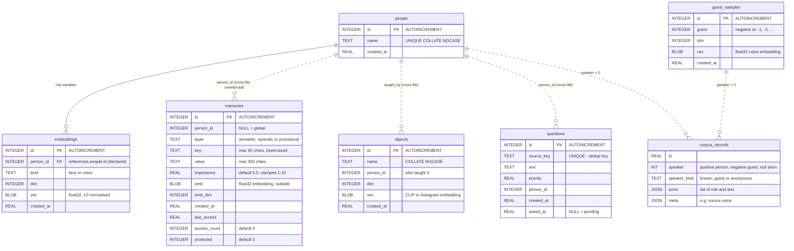

# ZERO — Data models & storage

There is **no ORM, no migration framework and no server database**. Persistence
is five independent SQLite files opened directly with `sqlite3.connect(...,
check_same_thread=False)`, each owned by exactly one repository class that
issues its own `CREATE TABLE IF NOT EXISTS` at construction time. Plus one
append-only JSONL corpus and one NumPy voiceprint file.

Everything is per-device state, not source: `.gitignore` excludes `*.sqlite`,
`*.npy` and `data/corpus/`.

| File (default path) | Owner class | Enabled by | Purpose |
|---|---|---|---|
| `zero_memory.sqlite` | `SqliteMemory` (`zero/memory/sqlite_memory.py`) | `memory.enabled` | Layered long-term memory |
| `zero_identity.sqlite` | `PersonRegistry` (`zero/identity/registry.py`) | `identity.enabled` | Enrolled people + their face/voice embeddings |
| `zero_guests.sqlite` | `GuestBook` (`zero/identity/guests.py`) | `identity.guests.enabled` | Provisional identities for unfamiliar voices |
| `zero_objects.sqlite` | `LearnedObjects` (`zero/vision/learned.py`) | `learning.objects.enabled` | Few-shot taught object names |
| `zero_curiosity.sqlite` | `CuriosityStore` (`zero/proactive/curiosity.py`) | `learning.curiosity.enabled` | Queued questions ZERO wants to ask |
| `data/corpus/interactions.jsonl` | `Corpus` (`zero/learning/corpus.py`) | `learning.corpus.enabled` | Per-speaker training data |
| `voiceprint.npy` | `build_voiceid` | `voiceid.enabled` | The single enrolled owner voiceprint |

All paths are resolved relative to the project root by `Config.resolve_path`.

---

## 1. Entity-relationship diagram

The join between files is `person_id` — an **application-level foreign key with
no database enforcement**, because the four stores live in separate SQLite
files. `people.id` is authoritative; everything else references it by
convention.



`corpus_records` is JSONL, not a table — it is shown here because it shares the
`speaker`/`person_id` key space and is the reason that key space matters.

---

## 2. `zero_memory.sqlite` — the memory store

### DDL as written

```sql
CREATE TABLE IF NOT EXISTS memories(
  id           INTEGER PRIMARY KEY AUTOINCREMENT,
  person_id    INTEGER,
  layer        TEXT,
  key          TEXT,
  value        TEXT,
  importance   REAL    DEFAULT 5.0,
  emb          BLOB,
  emb_dim      INTEGER,
  created_at   REAL,
  last_access  REAL,
  access_count INTEGER DEFAULT 0,
  protected    INTEGER DEFAULT 0
);
CREATE INDEX IF NOT EXISTS idx_mem_layer ON memories(layer, person_id);
```

`protected` is added by `_ensure_column` on databases created before it existed
(the only migration mechanism in the codebase, alongside `_migrate_legacy`).

### Layers

| Layer | Written by | `key` convention | Injected as |
|---|---|---|---|
| `semantic` | `remember()`, end-of-session fact extraction, reflection insights | model-chosen short lowercase key; `insight: …` for reflections; `note (<epoch>)` for explicit "remember that…" | "What you remember about the user" |
| `episodic` | `add_episode()`, `set_last_conversation()` | literally `episode`, or the reserved `__last_convo__` | "Recent conversations you've had with them" |
| `procedural` | `set_preference()` | `pref: <normalised text>` | "How they've asked you to behave" |

Writes are upserts for `semantic`/`procedural`: `(layer, key, person_id)` is
treated as a natural key and re-telling the same fact reinforces it
(`access_count + 1`). Episodic rows always insert.

### Retrieval — the activation formula

`SqliteMemory._activation` implements a Generative-Agents-style score:

```
relevance = cosine(query_emb, row_emb)          if dims match, clamped ≥ 0
          | keyword_overlap(query, text)        if no usable embedding
          | 1.0                                 if the query is empty

recency   = exp(-age_seconds / half_life_seconds)      # half_life_days = 14
freq      = 1 + 0.1 * ln(1 + access_count)

activation = relevance * (0.2 + 0.8 * recency) * (importance / 10) * freq
```

Rows below `memory.retrieval.min_activation` (0.05) never surface. The top
`top_k` hits are **reconsolidated on access** — `last_access` and `access_count`
are bumped in one `executemany`, so recalling a memory makes it easier to recall
again. This is done for every `search()` including the conversation-start
`as_block()` call.

Note the `emb_dim` guard: a row embedded with a different backend (256-d hash vs
768-d nomic) is simply skipped for vector scoring and falls back to keyword
overlap, so switching `memory.embeddings.backend` degrades retrieval instead of
corrupting it.

### Lifecycle

| Mechanism | Rule |
|---|---|
| Storage cap | `_prune_layer` keeps the `max_stored_*` most recently accessed rows per layer; `protected = 1` rows are exempt |
| Injection cap | `max_facts` (30) semantic + `recent_episodes` (3) + up to 8 preferences |
| Sleep-phase forgetting | `layer != 'procedural' AND protected = 0 AND importance < 6 AND access_count <= 1 AND last_access < now - 90d`, **max 10 rows per pass** so a bug cannot wipe the store |
| Reflection | needs ≥ 3 recent episodes; up to 3 insights written back at importance 7.0 |
| `forget_last(pid)` | deletes the newest row visible to that person (theirs or global), any layer |
| `forget_person(pid)` | deletes every row with that `person_id`; paired with `IdentityService.forget(name)` |
| `forget_all()` | truncates the table |

### The protected "last conversation" record

`set_last_conversation(person_id, summary)` writes **one** episodic row per
person, keyed `__last_convo__`, at `importance 9.0` and `protected = 1`, updated
in place. It is excluded from `recent_episodes()` and exempt from decay, age-out
and the episodic cap — this is what lets ZERO greet someone returning after
years with what they last discussed. No-op when `person_id is None`.

### Legacy migration

`_migrate_legacy()` runs once per database open. If the old flat tables exist it
copies `memory(key, value, updated_at)` into `semantic` rows at importance 5.0
and `episodes(summary, created_at)` into `episodic` rows at importance 4.0, then
`DROP TABLE`s both.

---

## 3. `zero_identity.sqlite` — people and embeddings

```sql
CREATE TABLE IF NOT EXISTS people(
  id         INTEGER PRIMARY KEY AUTOINCREMENT,
  name       TEXT UNIQUE COLLATE NOCASE,
  created_at REAL
);
CREATE TABLE IF NOT EXISTS embeddings(
  id         INTEGER PRIMARY KEY AUTOINCREMENT,
  person_id  INTEGER,
  kind       TEXT,          -- 'face' | 'voice'
  dim        INTEGER,
  vec        BLOB,
  created_at REAL,
  FOREIGN KEY(person_id) REFERENCES people(id)
);
```

This is the only declared foreign key in the codebase — and SQLite does not
enforce it unless `PRAGMA foreign_keys = ON`, which is never issued.

`add_embedding` caps stored samples at `identity.max_samples_per_kind` (5) per
person per kind, evicting oldest first. `match(kind, vec)` scans all samples of
that kind and returns the best `(person_id, name, cosine)`.

### How a match becomes a decision

`IdentityFuser` normalises `w_face` (0.55) and `w_voice` (0.45) and applies
three thresholds:

| Situation | Threshold |
|---|---|
| Both channels agree | `fusion.threshold` = 0.50 on the weighted score |
| Face only | `fusion.face_threshold` = 0.42 |
| Voice only | `fusion.voice_threshold` = 0.45 |

But for **session ownership** the fuser is bypassed: `identify_speaker()` uses
the voice channel alone against `voice_threshold`, and the face result is
returned separately as `face_name` for perception notes only. And for
**durable writes** a stricter `identity.session.write_min_score` (0.55) applies —
a borderline turn still gets a spoken reply but is not credited to that person's
permanent memory.

Confident joint matches (`via == "face+voice"` and score ≥
`reinforce_threshold` = 0.70) push the fresh embeddings back into the registry,
so recognition adapts to changing hairstyles, lighting and microphones.

---

## 4. `zero_guests.sqlite` — provisional identities

```sql
CREATE TABLE IF NOT EXISTS guest_samples(
  id         INTEGER PRIMARY KEY AUTOINCREMENT,
  guest      INTEGER,      -- negative: -1, -2, ...
  dim        INTEGER,
  vec        BLOB,
  created_at REAL
);
```

Unfamiliar voices are clustered by embedding rather than collapsed into one
"anonymous" bucket, so different strangers — and their training data — stay
separate. Guest ids are **negative** by construction, which is how
`Corpus._kind` and every downstream consumer distinguishes them from real
`people.id` values without a join.

Before a guest can be minted or matched, the turn must pass a quality gate in
`Zero._guest_worthy`: `≥ identity.guests.min_words` (2) words,
`≥ min_ms` (1200 ms) duration and `≥ min_rms` (150) level. This exists because
Whisper hallucinates plausible text from near-silence ("Obrigado", subtitle
credits) and those were minting phantom guests.

Clustering threshold is `identity.guests.match_threshold` (0.55 cosine); at most
`max_guests` (50) are kept.

---

## 5. `zero_objects.sqlite` — few-shot taught objects

```sql
CREATE TABLE IF NOT EXISTS objects(
  id         INTEGER PRIMARY KEY AUTOINCREMENT,
  name       TEXT COLLATE NOCASE,
  person_id  INTEGER,
  dim        INTEGER,
  vec        BLOB,
  created_at REAL
);
```

Populated by `parse_object_teach("this is a french press")` → `Eyes.teach_object`
→ `LearnedObjects.teach(name, crop_rgb, person_id)`. At detection time,
`annotate()` embeds each crop and overrides the COCO label when cosine exceeds
the threshold — `learning.objects.match_threshold` (0.80) with the local
histogram embedder, or `match_threshold_clip` (0.72) when the GPU CLIP embedder
is active, because CLIP's space is tighter.

Detections below `learning.objects.unknown_conf` (0.45) that match nothing
learned are recorded as "unfamiliar" and fed to the curiosity queue.

Two embedders satisfy the same duck-typed interface:

- `HistEmbedder` — a 3×3 grid of 12-bin hue + 8-bin gradient-orientation
  histograms. Offline, no model file, weak but instant.
- `ClipImageEmbedder` — an optional local CLIP image-encoder ONNX.
- Or, when the GPU is reachable, `RemoteObjectEmbedder` → `/perceive/embed_object`.

---

## 6. `zero_curiosity.sqlite` — the question queue

```sql
CREATE TABLE IF NOT EXISTS questions(
  id         INTEGER PRIMARY KEY AUTOINCREMENT,
  source_key TEXT UNIQUE,   -- dedup key
  text       TEXT,
  priority   REAL,
  person_id  INTEGER,
  created_at REAL,
  asked_at   REAL           -- NULL = still pending
);
```

Written silently while ZERO is alone (it never talks to an empty room), drained
opportunistically when a known person lingers. `source_key` is unique so the
same unfamiliar object cannot queue twice; re-adding an already-asked question is
governed by `min_repeat_s` (6 hours). `max_pending` defaults to 20.

---

## 7. `data/corpus/interactions.jsonl`

Appended once per ended session, **one record per speaker**, under a lock so
lines can never interleave. Written *before* the memory pass so a slow LLM
extraction cannot lose the raw data.

```json
{
  "ts": 1730000000.0,
  "speaker": 3,
  "speaker_kind": "known",
  "turns": [
    {"role": "user", "text": "..."},
    {"role": "assistant", "text": "..."}
  ],
  "meta": {"source": "voice"}
}
```

`speaker_kind` is derived: `> 0` → `known`, `< 0` → `guest`, `None` →
`anonymous`. Empty-text turns are dropped; a speaker whose turns are all empty
produces no record.

Privacy gating is identical to memory's — a turn the `PrivacyGuard` refused to
store never entered `_corpus_log`, so it cannot reach this file.

`scripts/export_corpus.py` converts the file into chat-format fine-tuning JSONL
(`{"messages": [...]}` per record), prepending the **live** `SYSTEM_TEMPLATE`
imported from `zero/llm/persona.py` so the training data can't drift from the
deployed persona. Filters: `--kinds known guest`, `--min-turns`.

---

## 8. Concurrency and durability characteristics

Worth knowing before adding writers:

- Every connection is `check_same_thread=False` and **shared across threads**
  with no explicit locking. The background memory-save thread, the tool threads
  and the main loop all use the same `SqliteMemory._db`. This relies on SQLite's
  own serialised threading mode. Under the current write volume (a handful of
  writes per session) it holds, but it is not a transactional design.
- No `PRAGMA journal_mode=WAL`, no `busy_timeout`, no explicit transactions —
  every write is its own implicit transaction followed by `commit()`.
- Two concurrent session-saves are prevented explicitly: `_persist_session`
  joins the previous save thread (≤ 60 s) before starting, because interleaved
  savers could double-consolidate and interleave corpus lines.
- Embeddings are stored as raw `float32` `tobytes()` with the dimension in a
  sibling column — no serialisation format, so a NumPy dtype change would
  silently break every stored vector.
