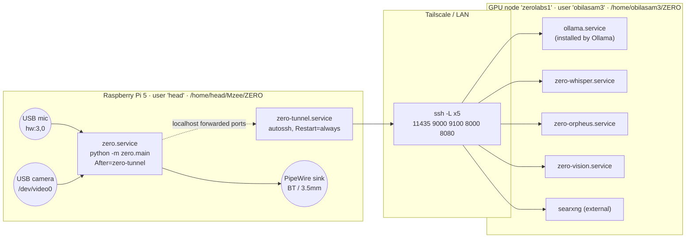

# ZERO — Deployment & infrastructure

**There is no Docker, no docker-compose, no Kubernetes, no Helm chart, no
Terraform and no cloud deployment in this repository.** Deployment is two
physical machines, systemd units, shell scripts and one SSH tunnel. Anything
you read elsewhere about containerising ZERO is not reflected in the code.

---

## 1. Topology



Ordering matters: `zero.service` declares
`After=network-online.target zero-tunnel.service sound.target` and
`Wants=zero-tunnel.service`, so the tunnel is up before the app tries to warm
the LLM. `Restart=always` on every unit is the "constantly running" guarantee —
a crashed Orpheus comes back state-free, a dropped tunnel is rebuilt by autossh.

---

## 2. First-time setup

### Pi — `scripts/setup_pi.sh`

One pass on a fresh 64-bit Raspberry Pi OS. `set -e`, `cd` to the repo root.

1. `apt install libportaudio2 libsndfile1 espeak-ng python3-venv pipewire-alsa`
2. Create `.venv`, upgrade pip
3. `pip install requests PyYAML numpy sounddevice soundfile cffi onnxruntime webrtcvad scipy scikit-learn tqdm`, then `openwakeword --no-deps` (tflite has no ARM wheel; it runs on ONNX) and `setuptools<81` (webrtcvad needs `pkg_resources`), then download the openWakeWord models
4. Piper: fetch `en_US-amy-medium.onnx` + `.json` and the arm64 release tarball
5. Identity models: `models/voiceid/`, `models/identity/`
6. Silero VAD ONNX (torch-free)
7. Vision extras (opencv, pydantic)
8. Optional local Whisper fallback (`base.en`)

It prints next steps: open the tunnels, set the mic gain as a *percent*
(`amixer -c 3 set Mic 60%`), then `python -m zero.main` (or `--text` for a
brain-only test with no mic or audio stack).

Note this installs a **superset** of `requirements.txt` (`cffi`, `scipy`,
`scikit-learn`, `tqdm` are not declared anywhere) — see the drift table in
`architecture.md` §8.

### GPU — `scripts/run_gpu_servers.sh`

Idempotent by port probing (`/dev/tcp` check), each server launched detached with
`setsid nohup` so it survives the shell, logs to `$ZERO_LOG_DIR`
(default `~/zero_logs`).

| Service | Port | Command |
|---|---|---|
| Ollama | 11434 | `ollama serve` — only if not already listening |
| Whisper | 9000 | `python server/whisper_server.py --model large-v3-turbo --port 9000` |
| Orpheus | 9100 | `orpheus_cpp_server.py`, or `orpheus_server.py` when `ORPHEUS_FP16=1` |
| Vision | 8000 | `cd server/vision && uvicorn app:app --host 0.0.0.0 --port 8000` |

The `cd` before uvicorn is load-bearing: `server/vision/app.py` resolves its
relative imports and its `config.yaml` from that directory.

> Inconsistency worth noting: this script passes `--model large-v3-turbo` while
> `zero-whisper.service` and the argparse default use
> `deepdml/faster-whisper-large-v3-turbo-ct2`. The docstring explains why —
> the bare alias has pulled incomplete snapshots. The script was not updated.

---

## 3. The SSH tunnel — `scripts/pi_tunnel.sh`

One tunnel carries all five services; nothing is exposed to the internet.

```
local :11435 -> GPU :11434   Ollama   (LLM + embeddings)
local :9000  -> GPU :9000    Whisper  (STT)
local :9100  -> GPU :9100    Orpheus  (TTS)
local :8000  -> GPU :8000    Vision   (depth, VLM, /perceive/*)
local :8080  -> GPU :8080    SearXNG  (web search)
```

SSH options are tuned for an unattended, network-crossing tunnel:

| Option | Why |
|---|---|
| `StrictHostKeyChecking=accept-new` | A systemd service has nobody to answer a host-key prompt |
| `ServerAliveInterval=15`, `ServerAliveCountMax=3` | Drop and let autossh rebuild within ~45 s of a stall |
| `ExitOnForwardFailure=yes` | Fail loudly if a port is already bound rather than half-working |
| `ConnectTimeout=10` | Fail fast on a bad network so the retry loop kicks in |

`autossh -M 0` when available; plain `ssh -N` otherwise (with a warning that
there is no auto-reconnect). `GPU_HOST` is required — the script exits 2 without
it. The shipped unit sets a **Tailscale IP** rather than a hostname, so the
tunnel works on any network; MagicDNS names also work.

---

## 4. systemd units

All five live in `scripts/systemd/` pre-filled for the real machines.

### GPU node

```bash
sudo cp scripts/systemd/zero-whisper.service /etc/systemd/system/
sudo cp scripts/systemd/zero-orpheus.service /etc/systemd/system/
sudo cp scripts/systemd/zero-vision.service  /etc/systemd/system/
sudo systemctl daemon-reload
sudo systemctl enable --now zero-whisper zero-orpheus zero-vision
```

| Unit | User | WorkingDirectory | ExecStart |
|---|---|---|---|
| `zero-whisper` | obilasam3 | `/home/obilasam3/ZERO` | `.venv/bin/python server/whisper_server.py --model deepdml/faster-whisper-large-v3-turbo-ct2 --port 9000` |
| `zero-orpheus` | obilasam3 | `/home/obilasam3/ZERO` | `.venv/bin/python server/orpheus_cpp_server.py --port 9100` |
| `zero-vision` | obilasam3 | `/home/obilasam3/ZERO/server/vision` | `.venv/bin/uvicorn app:app --host 0.0.0.0 --port 8000` |

All three: `Type=simple`, `Restart=always`, `RestartSec=3`,
`After/Wants=network-online.target`, `WantedBy=multi-user.target`.
Ollama installs its own `ollama.service`.

### Pi

```bash
sudo cp scripts/systemd/zero-tunnel.service /etc/systemd/system/
sudo cp scripts/systemd/zero.service        /etc/systemd/system/
sudo systemctl daemon-reload
sudo systemctl enable --now zero-tunnel zero
journalctl -u zero -f
```

| Unit | User | ExecStart | Extra |
|---|---|---|---|
| `zero-tunnel` | head | `bash /home/head/Mzee/ZERO/scripts/pi_tunnel.sh` | `Environment=GPU_HOST=obilasam3@100.110.56.17`, `AUTOSSH_GATETIME=0`, `RestartSec=3` |
| `zero` | head | `/home/head/Mzee/ZERO/.venv/bin/python -m zero.main` | `WorkingDirectory=/home/head/Mzee/ZERO`, `RestartSec=5`, ordered after the tunnel and `sound.target` |

Prerequisites for the tunnel unit: the Pi's SSH key installed on the GPU
(`ssh obilasam3@zerolabs1 'echo ok'` must succeed non-interactively) and
`autossh` installed.

### Restarting everything

```bash
sudo systemctl restart zero-whisper zero-orpheus zero-vision   # GPU
sudo systemctl restart zero-tunnel zero                        # Pi
```

---

## 5. Targeted redeploy — `scripts/deploy_control_pi.sh`

A one-shot, idempotent deploy of just the control-plane change. Usage:
`bash scripts/deploy_control_pi.sh [head@192.168.150.202]`.

1. `scp` `zero/control.py` and `zero/main.py` to `~/Mzee/ZERO`
2. Append a `control:` block to the Pi's `config.yaml` **only if absent** — the
   live config is never overwritten, so on-device audio tuning survives
3. Ensure `ffmpeg` is installed (it decodes the cockpit's webm/opus uploads)
4. `systemctl restart zero.service`, then probe `/health` and `/zero/status`

This is a file-copy deploy, not a package or image deploy: there is no version
pinning, no rollback, and no atomic switch. The rest of the tree on the Pi is
assumed to be a git checkout kept in sync manually.

---

## 6. Health checking

`scripts/healthcheck.sh` (run on the Pi by default, `--gpu` to use Ollama's real
port 11434 instead of the tunnelled 11435):

| Check | URL |
|---|---|
| LLM | `http://127.0.0.1:11435/api/tags` |
| STT | `http://127.0.0.1:9000/health` |
| TTS | `http://127.0.0.1:9100/health` |
| Vision | `http://127.0.0.1:8000/health` |
| Detect | `POST http://127.0.0.1:8000/perceive/detect` with `{"image_jpeg_b64":""}` |

HTTP 200/404/405/422 all count as UP — the point is to prove something is
listening and answering, and the deliberately empty-image POST is expected to
422. 5-second curl timeout per check.

---

## 7. CI — `.github/workflows/ci.yml`

Triggers on **every push and every pull request**. One job, `test`, on
`ubuntu-latest`:

```yaml
- uses: actions/checkout@v4
- uses: actions/setup-python@v5      # python-version: "3.11"
- run: pip install numpy PyYAML requests pydantic pytest ruff
- run: ruff check zero tests         # lint: syntax errors + pyflakes
- run: pytest -q
```

Deliberately minimal dependencies: only what the pure-logic tests import. The
heavy stacks (`sounddevice`, `opencv`, `onnxruntime`, `pywhispercpp`) are
exercised on-device, not in CI. Ruff runs with `select = ["E9", "F"]`,
`ignore = ["E731"]` — syntax errors, undefined names and unused imports only,
not style.

Verified on this checkout: **374 tests pass in ~6 s** with exactly those five
packages installed.

There is **no build step, no artifact, no publish, no deploy stage and no
matrix**. `pyproject.toml` declares a setuptools build backend and a `zero`
console script, but nothing in CI builds a wheel or pushes one anywhere.

### Test coverage map

| Test module | Subject |
|---|---|
| `test_config`, `test_conversation`, `test_session_memory`, `test_memory`, `test_memory_v2` | Config merge, prompt assembly, trimming/compaction, both memory generations |
| `test_capture`, `test_microphone`, `test_endpointer`, `test_wake`, `test_wake_loop`, `test_duplex` | Audio I/O, VAD/endpointing, wake word, barge-in |
| `test_identity`, `test_guests`, `test_privacy`, `test_persona` | Identity fusion, guest clustering, bystander modes, prompt |
| `test_perception`, `test_remote_perception`, `test_heuristics`, `test_turn_notes` | Affect/diarization, `/perceive/*` clients and fallbacks, visual-turn routing, note assembly |
| `test_tools`, `test_websearch`, `test_fallback`, `test_tts` | Tool router tiers, SearXNG parsing, failover wrappers, cue translation |
| `test_proactive`, `test_learning`, `test_corpus` | Policy gates, object teaching, JSONL corpus |
| `test_schema_sync` | Field-name parity between the two wire-schema copies (**names only — not requiredness**) |

---

## 8. Operational realities to plan for

| Concern | Current state |
|---|---|
| **Secrets** | None in the repo. Auth to the GPU is SSH key only. No API keys anywhere |
| **Attack surface** | `:8090` control plane and (if `preview_host: 0.0.0.0`) `:8008` camera stream are unauthenticated on the LAN |
| **VRAM contention** | Gemma + Whisper turbo + Orpheus + YOLO11x + CLIP + faces share one 16 GB card. `llm.num_ctx` was halved to 4096 for exactly this reason; `OLLAMA_MAX_LOADED_MODELS=2` is suggested in a `config.yaml` comment for keeping the embedding model resident |
| **Pi RAM** | 8 GB. The README notes the LLM + whisper + Fish do not all fit resident |
| **State backup** | Nothing backs up the five `.sqlite` files or `data/corpus/` — they are gitignored per-device state. Losing the SD card loses every enrolled person and every memory |
| **Model provisioning** | `models/` is gitignored and populated by `setup_pi.sh`; GPU models download on first use (YOLO11x, CLIP, Depth Anything, Qwen2-VL, Orpheus GGUF, faster-whisper CT2). First call to each endpoint is slow |
| **Log rotation** | None configured. `run_gpu_servers.sh` appends to `~/zero_logs/*.log` indefinitely; the systemd path relies on journald defaults |
| **Rollback** | None. `deploy_control_pi.sh` overwrites files in place |
